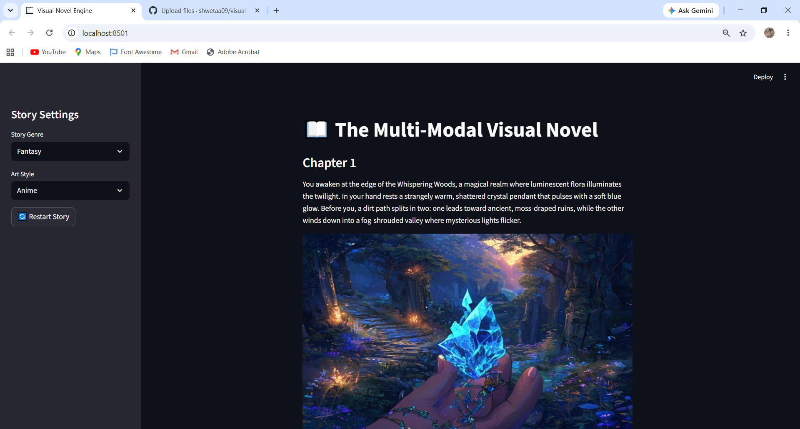

# 📖 The Multi-Modal Visual Novel

An AI-powered "Choose Your Own Adventure" engine built with Streamlit, Google Gemini,
Pollinations AI, and Google Text-to-Speech (gTTS).

## Features
- *Structured JSON Engine*: Gemini is instructed to return strict JSON with story text,
  an image prompt, and player choices — parsed using Python's json library.
- *Dynamic UI Generation*: Choice buttons are generated on the fly from the AI's response,
  not hardcoded.
- *Multi-Modal Output*: Every chapter includes AI-generated narrative text, an AI-generated
  scene image (Pollinations API), and narrated audio (gTTS).
- *Stateful Architecture*: Full story history, images, and audio persist across reruns using
  st.session_state.
- *Graceful Failure Handling*: All external API calls are wrapped in try/except blocks —
  if the image or audio service fails, the story continues instead of crashing.

## Screenshots

### Story in progress

## Tech Stack
- Streamlit (UI framework)
- Google Gemini API (story generation, via google-generativeai)
- Pollinations AI (image generation)
- gTTS (text-to-speech narration)

## Assignment
MirAI School of Technology - Virtual Summer Internship 2026
"AI Builder" Track - Capstone Mini-Project: The Multi-Modal Visual Novel
